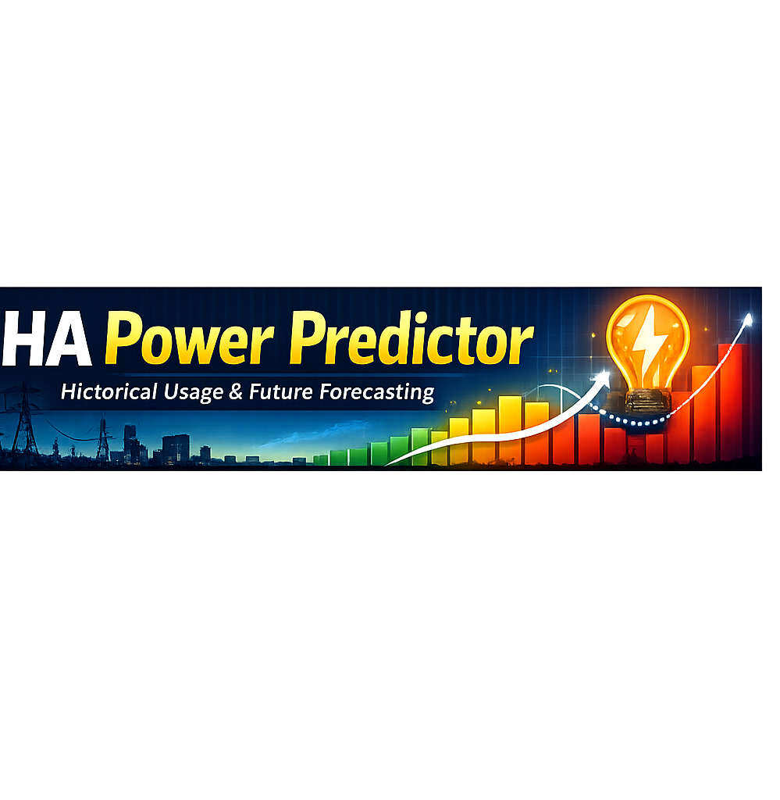
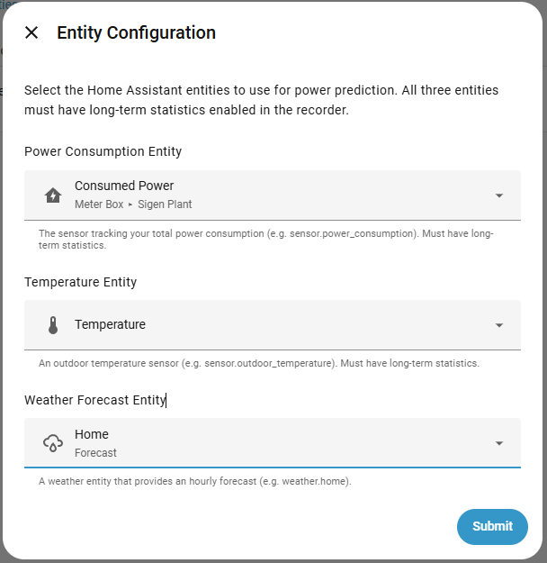
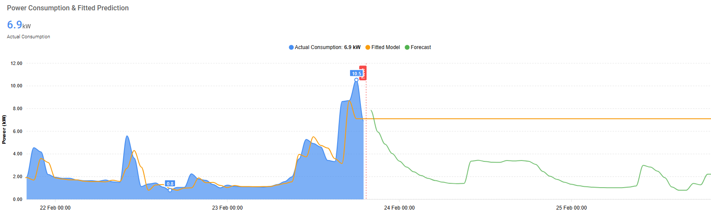

# HA Power Predictor

[](https://github.com/isaacjmannion/ha-power-predictor/releases)
[](https://github.com/hacs/integration)
[](LICENSE)

Forecast future power consumption directly within Home Assistant using your historical usage and weather data.

---

## About

**HA Power Predictor** is a custom Home Assistant integration that uses quantile regression to forecast future power consumption based on historical power usage, observed temperatures, and weather forecast data, with support for dynamic peak/off-peak modelling.

### Features

- 📊 **Configurable Predictions** — Quantile regression with adjustable percentiles for conservative or typical forecasts
- ⏰ **Peak/Off-Peak Modelling** — Apply different prediction strategies depending on the time of day
- 🔌 **Home Assistant Integration** — Prediction results published automatically as HA sensors
- 📈 **Multiple Time Windows** — Forecast sensors for 24 h and 48 h ahead
- 🔄 **Fitted Model Sensor** — In-sample fitted values for charting model accuracy against historical data
- 🔁 **Configurable Update Interval** — Retrain and refresh on your own schedule

---

## Installation

### Via HACS (Recommended)

1. Open **HACS** in your Home Assistant sidebar
2. Go to **Integrations**
3. Click the **⋮** menu (top right) and select **Custom repositories**
4. Enter the repository URL: `https://github.com/isaacjmannion/ha-power-predictor`
5. Set the category to **Integration** and click **Add**
6. Search for **HA Power Predictor** in HACS and click **Download**
7. Restart Home Assistant
8. Go to **Settings → Devices & Services → Add Integration** and search for **HA Power Predictor**

### Manual Installation

1. Download the latest release from the [Releases page](https://github.com/isaacjmannion/ha-power-predictor/releases)
2. Extract and copy the `ha_power_predictor` folder into your `config/custom_components/` directory
3. Restart Home Assistant
4. Go to **Settings → Devices & Services → Add Integration** and search for **HA Power Predictor**

---

## Setup

The integration is configured entirely via the UI — no YAML required.

### Step 1 — Entity Configuration

Provide three entities during initial setup:

| Field | Description |
|-------|-------------|
| **Power Consumption Entity** | Your total power sensor (e.g. `sensor.sigen_plant_consumed_power`). Long-term statistics are helpful. |
| **Temperature Entity** | An outdoor temperature sensor (e.g. `sensor.outdoor_temperature`). Long-term statistics are helpful. |
| **Weather Forecast Entity** | A weather entity providing an hourly forecast (e.g. `weather.home`). |

### Step 2 — Model Parameters

Tune the model behaviour via **Settings → Devices & Services → HA Power Predictor → Configure**:

| Option | Description | Default |
|--------|-------------|---------|
| `History Days` | Days of historical data to train on | 30 |
| `Update Interval (minutes)` | How often to retrain and refresh | 10 |
| `Min Predicted Power (kW)` | Clamp predictions to at least this value | 0.5 |
| `Max Predicted Power (kW)` | Clamp predictions to at most this value | 15.0 |
| `Power Lag Features` | Previous hourly power readings used as model features | 5 |
| `Temperature Lag Features` | Previous hourly temperature readings used as model features | 5 |
| `Peak Start Hour` | Hour the peak period begins (0–23, inclusive) | 9 |
| `Peak End Hour` | Hour the peak period ends (0–23, inclusive) | 22 |
| `Peak Quantile` | Quantile applied during peak hours | 0.75 |
| `Off-Peak Quantile` | Quantile applied during off-peak hours | 0.50 |
| `Time-of-day Detail (hour harmonics)` | sin/cos harmonics shaping the daily curve: `0` = straight ramp (old behaviour), `2` = morning + evening peaks, `3` = finer (see [Forecast Sharpness & Feature Weights](#forecast-sharpness--feature-weights)) | 2 |
| `Regularisation Strength (alpha)` | L2 strength on the standardised features; higher smooths the fit and makes the influence weights below bite harder | 1.0 |
| `Time-of-day Influence Weight` | Relative influence of the time-of-day features (`0` disables, `>1` amplifies) | 1.0 |
| `Temperature Influence Weight` | Relative influence of temperature and its lag features | 1.0 |
| `Recent-usage (Lag) Influence Weight` | Relative influence of the power-lag features | 1.0 |
| `Max Forecast Hours` | Maximum hours to forecast (48–168 hours / 2-7 days) | 48 |
| `Hour-of-day Offsets` | Fixed kW added at chosen hours of the day, local time (see [Hour-of-day Offsets](#hour-of-day-offsets)) | _(none)_ |

> **Note**: Forecasts beyond weather forecast availability (typically 2-3 days) will use historical average temperature and may have reduced accuracy.

### Forecast Sharpness & Feature Weights

If your forecast looks too flat or smooth compared to your real daily load, the most effective lever is **Time-of-day Detail**. The model is linear, so the hour-of-day is encoded as cyclical (sin/cos) features — a single straight ramp can't represent a curve with both a morning and an evening peak, but `2` harmonics can. Set it to `0` to fall back to the old single-ramp behaviour.

The three **influence weights** let you dial how much each group of features drives the prediction — for example, raise `Time-of-day Influence Weight` and lower `Temperature Influence Weight` if the weather signal is washing out your daily pattern. Weights are a *relative-influence* control, not a sharpness lever on their own, and they only take effect when `Regularisation Strength (alpha)` is non-zero (features are standardised first so the weights are comparable across groups). A weight of `1.0` is neutral; `0` disables that group entirely.

### Hour-of-day Offsets

If a known recurring load isn't captured well by the model — an EV charging overnight, a pool pump on a timer — add a **fixed kW offset at a specific hour of the day** (local clock time). Under **Configure**, add a row giving the hour (0–23) and the kW to add; the offset is applied at that hour **every day**. Offsets may be negative, hours you don't list are left unchanged, and the result is still bounded by the Min/Max Predicted Power clamp.

Example — add 7 kW while an EV charges from 1 am to 4 am:

| Hour of day | Offset (kW) |
|-------------|-------------|
| 1 | 7 |
| 2 | 7 |
| 3 | 7 |
| 4 | 7 |

> Hours are **local clock time** — e.g. hour 13 applies at 1 pm every day.

---

## Exporting Data for Offline Analysis

To tune settings or test changes without touching your live instance, the
predictor exposes two buttons:

- **Export Training Data** — exports the configured *History Days* window.
- **Export All History** — exports up to a year of available recorder data.

Pressing either writes a self-describing JSON file (raw hourly power +
temperature statistics, plus the full resolved configuration) to your Home
Assistant **config directory**; a notification shows the exact path. Because the
raw statistics are exported, an offline script can replay the integration's
exact pipeline.

The repo ships such a script, [`tools/backtest.py`](tools/backtest.py), which
backtests the forecast and sweeps settings to find the best combination:

```bash
python tools/backtest.py your_export.json            # backtest the exported config
python tools/backtest.py your_export.json --sweep    # grid-search better settings
```

See [`tools/README.md`](tools/README.md) for details and the metrics it reports.

---

## Published Sensors

After the first successful prediction run, four sensors are created:

| Sensor | State | Description |
|--------|-------|-------------|
| `sensor.power_prediction_24h` | kW | Predicted load for the next hour; includes a `forecast` attribute with hourly values for the next 24 hours |
| `sensor.power_prediction_48h` | kW | Predicted load for the next hour; includes a `forecast` attribute with hourly values for the next 48 hours |
| `sensor.power_prediction_extended` | kW | Predicted load for the next hour; includes a `forecast` attribute with all available hours up to `max_forecast_hours` (configurable: 48-168 hours) |
| `sensor.power_prediction_fitted_model` | % | In-sample coverage — the fraction of historical hourly values that fell at or below the model's prediction (e.g. ~75% for a well-calibrated `q=0.75` model); includes a `fitted` attribute with hourly fitted values for the previous 48 hours |

### Sensor Attribute Format

All prediction sensors share these common attributes:

```yaml
source_entity: sensor.sigen_plant_consumed_power
history_days: 15
last_forecast_update: "February 23, 2026 at 11:21:06"
```

`sensor.power_prediction_24h` / `sensor.power_prediction_48h` / `sensor.power_prediction_extended` also expose:

```yaml
forecast:
  - time: '2026-02-23T12:00:00+11:00'
    value: 2.98
  - time: '2026-02-23T13:00:00+11:00'
    value: 3.37
  # ... one entry per hour for the window
```

`sensor.power_prediction_fitted_model` also exposes:

```yaml
fitted:
  - time: '2026-02-21T11:00:00+11:00'
    value: 1.39
  - time: '2026-02-21T12:00:00+11:00'
    value: 1.41
  # ... one entry per hour for the past 48 hours
training_samples: 360
```

---

## Dashboard Example

Here is an ApexCharts card that plots 2 days of historical consumption alongside the fitted model and 48 h forecast:

```yaml
type: custom:apexcharts-card
graph_span: 96h
span:
  end: hour
  offset: +48h
header:
  show: true
  title: Power Consumption & Prediction
  show_states: true
  colorize_states: true
now:
  show: true
  label: Now
  color: '#ff4444'
apex_config:
  chart:
    height: 400
  yaxis:
    title:
      text: Power (kW)
    decimalsInFloat: 2
series:
  - entity: sensor.sigen_plant_consumed_power
    name: Actual Consumption
    type: area
    stroke_width: 2
    color: '#2196F3'
    extend_to: false
    fill_raw: last
    group_by:
      func: avg
      duration: 1h
  - entity: sensor.power_prediction_fitted_model
    name: Fitted Model
    type: line
    color: '#ff9800'
    curve: smooth
    stroke_width: 2
    data_generator: |
      const fitted = entity.attributes.fitted || [];
      const now = Date.now();
      return fitted
        .filter(item => {
          if (!item || !item.time || item.value === undefined) return false;
          const itemTime = new Date(item.time).getTime();
          return itemTime < now - 60000;
        })
        .map(item => [new Date(item.time).getTime(), parseFloat(item.value)]);
  - entity: sensor.power_prediction_48h
    name: 48 h Forecast
    type: line
    color: '#4caf50'
    curve: smooth
    stroke_width: 2
    data_generator: |
      const forecast = entity.attributes.forecast || [];
      return forecast
        .filter(item => item && item.time && item.value !== undefined)
        .map(item => [new Date(item.time).getTime(), parseFloat(item.value)]);
```

> Requires [ApexCharts Card](https://github.com/RomRider/apexcharts-card) installed via HACS.

---

## Requirements

- Home Assistant **2025.7** or newer (the hourly-offset editor uses the object-selector row form introduced in 2025.7)
- The power and temperature entities must have **long-term statistics** enabled (recorder integration, statistics enabled for the entity)
- A weather entity providing an **hourly forecast**

---

## Screenshots

### Integration Config Flow


### Dashboard Chart


---

## Support

- **Issues**: [GitHub Issues](https://github.com/isaacjmannion/ha-power-predictor/issues)
- **Discussions**: [GitHub Discussions](https://github.com/isaacjmannion/ha-power-predictor/discussions)

## Changelog

### 0.3.0 — Sharper forecasts: cyclical hour features + feature weights
- **New — cyclical hour-of-day features:** the hour is now encoded as sin/cos harmonics instead of a single linear term, so the model can represent a bimodal daily load curve (a morning *and* an evening peak) rather than a single straight ramp. Configurable via **Time-of-day Detail (hour harmonics)** (`0` = old linear behaviour, default `2`). This is the main lever for forecast sharpness.
- **New — feature influence weights:** three sliders — **Time-of-day**, **Temperature**, and **Recent-usage (Lag)** influence weights — let you dial how strongly each group of features drives the prediction (e.g. favour time-of-day over temperature). `1.0` is neutral, `0` disables a group.
- **New — Regularisation Strength (alpha):** exposes the L2 strength, which now applies to **standardised** features (the model z-scores its inputs before fitting). Standardisation makes the penalty act evenly across features and is what makes the influence weights comparable and effective.
- **New — data export + offline backtesting:** *Export Training Data* / *Export All History* buttons write raw stats + config to a JSON file in the config dir, and a bundled `tools/backtest.py` replays the exact pipeline offline to backtest and sweep settings (see [Exporting Data for Offline Analysis](#exporting-data-for-offline-analysis)).
- **Behaviour change:** because of standardisation and the new default `alpha` (1.0, was an internal 0.01), forecasts will differ from 0.2.x even with the new weights left at their neutral defaults. Set `hour harmonics` to `0` and the weights to `1.0` for the closest match to the old shape.
- Corrected stale entries in the Model Parameters table (update interval, min/max power defaults) and removed the obsolete `Use Dynamic Quantile` / `Quantile` rows (peak/off-peak quantiles are always active).

### 0.2.2 — Hour-of-day offsets, faster updates, DST fix
- **New — Hour-of-day offsets:** add a fixed kW offset at chosen hours of the day (local clock time) to capture known recurring loads — e.g. +7 kW while an EV charges overnight. Configured as rows of `{hour, offset}`; the offset is applied at that hour every day and stays bounded by the Min/Max Predicted Power clamp.
- Update interval can now be set as low as **5 minutes** (was 15).
- Fixed a crash at daylight-saving transitions when localizing timezone-naive weather forecast timestamps (e.g. BoM): both the fall-back (repeated hour) and spring-forward (skipped hour) are now handled.
- **Requires Home Assistant 2025.7 or newer** (the hour-of-day offset editor uses the object-selector row form introduced in 2025.7).
- Developer tooling: added CI (hassfest, HACS, ruff, pytest + a Home Assistant harness job) and release automation via GitHub Actions.

### 0.2.1 — Extended forecast support
- Added configurable extended forecast sensor with 2-7 day range
- New `sensor.power_prediction_extended` provides forecasts up to 168 hours (7 days)
- Configurable max forecast hours via options (48-168 hours, step: 24)
- Forecast gracefully falls back to historical mean temperature beyond weather data availability

### 0.2.0 — Bug fixes and UI improvements
- Dynamic peak/off-peak quantile is now always active (toggle removed)
- Peak and off-peak quantiles remain fully configurable
- Fixed `NameError` crash when dynamic quantile toggle was disabled
- Fixed timezone-naive forecast handling for BoM and similar integrations
- Added customizable integration name to support multiple predictor instances
- Fixed ApexCharts fitted model line extending past "Now" marker
- Added banner image and integration logo for HACS and Home Assistant UI

### 0.1.0 — Initial Release
- Quantile regression model for power consumption forecasting
- Dynamic peak/off-peak quantile support
- `sensor.power_prediction_24h`, `sensor.power_prediction_48h`, and `sensor.power_prediction_fitted_model` sensors
- Fully UI-configurable via config flow
- Button entity to manually trigger a prediction refresh

## License

MIT License — see [LICENSE](LICENSE) for details.
